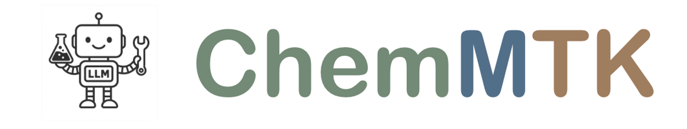
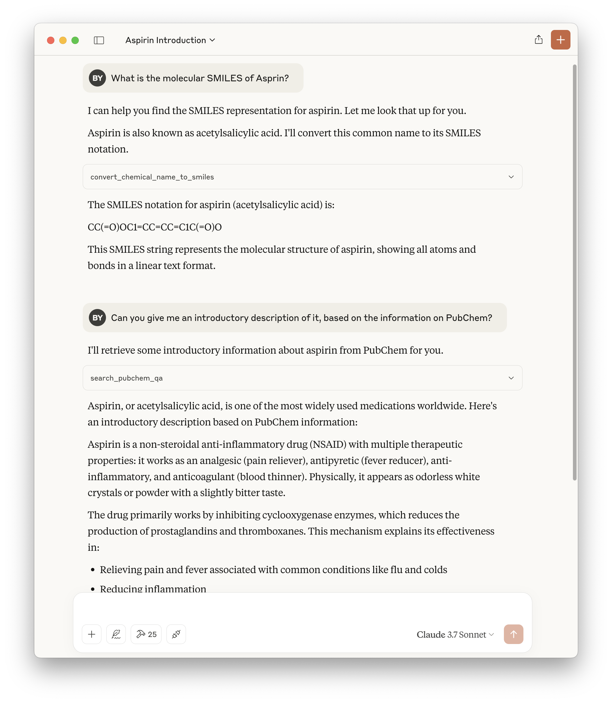

# ChemMTK - Chemistry MCP ToolKit



## What is this?

ChemMTK (Chemistry MCP ToolKit) is **a specialized Model Context Protocol (MCP) server** that empowers AI assistants with advanced chemistry capabilities. By integrating **powerful chemistry tools**, ChemMTK **transforms general AI models into chemistry experts** capable of performing complex molecular analysis, property prediction, and reaction synthesis tasks without requiring domain-specific training. The current tools are from our [ChemToolAgent](https://osu-nlp-group.github.io/ChemToolAgent/), separated from the agent for easier and broader use.

[MCP (Model Context Protocol)](https://modelcontextprotocol.io/introduction) is a framework that allows AI models to access external tools and resources through a standardized interface. ChemMTK leverages this architecture to bridge the gap between general-purpose AI models and specialized chemistry tools, enabling seamless integration of chemistry expertise into AI workflows.

With ChemMTK, you can:

- Convert between different molecular representations (SMILES, IUPAC, chemical names, etc.)
- Analyze molecular properties and structures
- Predict critical pharmacological properties (solubility, toxicity, BBB penetration)
- Check molecule patent status and pricing information
- Perform forward and retrosynthesis reaction predictions
- Access scientific databases like PubChem for detailed compound information
- ... (more to come)

We will continue to add and maintain tools in ChemMTK. **You are more than welcome to contribute, by maining existing tools or adding new tools!**


## Usage

ChemMTK follows standard MCP integration patterns, making it straightforward to incorporate into your AI workflows.

**Note**: Tested only on Linux and macOS. Windows support depends on whether the dependent packages are compatible.

### Setup

**Install uv**

We recommend using [uv](https://github.com/astral-sh/uv) to manage the environment. Install uv:

```bash
# On macOS and Linux.
curl -LsSf https://astral.sh/uv/install.sh | sh
```

**Download ChemMTK**

```bash
git clone https://github.com/OSU-NLP-Group/ChemMTK.git
```

**Install Environment and Run**

```bash
cd ChemMTK
uv run -m chemmtk
```

The server should run without error. If that is the case, you can kill it and check the following sections to integrate with your AI assistants.

**Environment Variables**

To make tools work properly, some variables containing API keys and configurations should be correctly set. Please get them before applying ChemMTK.

```python
{
  "CHEMSPACE_API_KEY": "YOUR_CHEMSPACE_API",  # https://chem-space.com/
  "RXN4CHEM_API_KEY": "YOUR_IBM_RXN4CHEM_API",  # https://rxn.res.ibm.com
  "TAVILY_API_KEY": "YOUR_TAVILY_API",  # https://tavily.com/
  # For tools using LLMs, set an LLM name in the LiteLLM way
  # https://docs.litellm.ai/docs/#litellm-python-sdk
  "LLM_MODEL_NAME": "YOUR_LLM_MODEL_NAME_IN_LITELLM",  # E.g., "openai/gpt-4o", "azure/gpt-4o"
  # Then set necessary credentials for the LLM, such as OPENAI_API_KEY, AZURE_API_KEY, AZURE_API_BASE, etc.
  # ...
}
```


### Use Case 1: Integration with LLM APIs

LLM providers provide their SDKs to support MCP servers. Take OpenAI Agents SDK as an example, you can connect to ChemMTK using the following lines. See [this page](https://openai.github.io/openai-agents-python/mcp/) for details.

```python
async with MCPServerStdio(
    params={
        "command": "uv",
        "args": ["--directory", "/PATH/TO/ChemMTK", "run", "-m", "chemmtk"],
        "toolCallTimeoutMillis": 300000,
        "env": envs,  # See the above "Environment Variables" section
    }
) as server:
    tools = await server.list_tools()
```

### Use Case 2: Integration with LLM GUI Client (Claude Desktop)

Anthropic's Claude Desktop is the best client for MCP until know. Follow [this tutorial](https://modelcontextprotocol.io/quickstart/server#testing-your-server-with-claude-for-desktop) to configure the client for ChemMTK. Specifically, you can see the JSON file like the following, pretty much the same as in OpenAI's API.

```json
{
    "mcpServers": {
        "ChemMTK": {
            "command": "uv",
            "args": ["--directory", "/PATH/TO/ChemMTK", "run", "-m", "chemmtk"],
            "toolCallTimeoutMillis": 300000,
            "env": envs,  # See the above "Environment Variables" section
        }
    }
}
```

<details>
  <summary>An example of Claude using ChemMTK to do chemistry tasks.</summary>
  
</details>
### Use Case 3: More Applications Supporting MCP

Check [here](https://modelcontextprotocol.io/clients) for more information.

## Tool List

Based on the functions, the tools can be divided into general tools, molecule tools, and reaction tools, listed below.

**General Tools**: Provide broad information retrieval and web searching.

| Tool Name  | Description                                                  | Input            | Output                                | Implementation                                               |
| ---------- | ------------------------------------------------------------ | ---------------- | ------------------------------------- | ------------------------------------------------------------ |
| search_web | Search the web for questions and knowledge, obtaining concise summaries of relevant content | `query` (string) | Summaries of related content (string) | Use [Tavily](https://tavily.com/) to provide LLM-summarized search results |

**Molecule Tools**: Offer various analyses, predictions, and conversions related to chemical compounds and their properties.

| Tool Name                          | Description                                         | Input                                              | Output                                             | Implementation |
| ---------------------------------- | --------------------------------------------------- | ------------------------------------------------------------ | -------------------------------------------------- | ---------------------------------- |
| search_pubchem_qa | Answer questions about a molecule/compound based on its PubChem page | `namespace` (string: "smiles", "iupac", or "name"), `identifier` (string), `question` (string) | Answer based on PubChem page (string) | Retrieve information from [PubChem](https://pubchem.ncbi.nlm.nih.gov/) and prompt an LLM to answer related questions |
| cal_molecule_similarity            | Get Tanimoto similarity of two molecules            | `smiles1` (string), `smiles2` (string)                       | Tanimoto similarity score and description (string) | Use RDKit to calculate the similarity and generate rule-based descriptions |
| cal_molecular_weight               | Calculate molecular weight                          | `smiles` (string)                                            | Molecular weight (float)                           | Use RDKit to calculate molecular weight |
| get_functional_groups              | Get functional groups in a molecule                 | `smiles` (string)                                            | List of functional groups (string)                 | Use RDKit and rules to determine functional groups |
| canonicalize_smiles                | Canonicalize a molecular SMILES string              | `smiles` (string), `isomeric` (boolean, default=true), `kekulization` (boolean, default=true), `keep_atom_map` (boolean, default=true) | Canonicalized SMILES string (string)               | Use RDKit to canonicalize |
| count_molecule_atoms               | Count atoms of each type in a molecule              | `smiles` (string)                                            | Number of atoms (string)                           | Use RDKit to count and then generate rule-based descriptions |
| get_molecule_price                 | Get cheapest available price of a molecule          | `smiles` (string)                                            | Description of cheapest price (string)             | Use [ChemSpace](https://chem-space.com/) to obtain prices and vendors |
| check_molecule_if_patented         | Check if a molecule is patented                     | `smiles` (string)                                            | "patented" or "not patented" (string)              | Use [ChemSpace](https://chem-space.com/) to |
| convert_iupac_to_smiles            | Convert IUPAC name to SMILES                        | `iupac` (string)                                             | SMILES string                                      | Use [PubChem](https://pubchem.ncbi.nlm.nih.gov/) and [ChemSpace](https://chem-space.com/) to obtain |
| convert_smiles_to_iupac            | Convert SMILES to IUPAC name                        | `smiles` (string)                                            | IUPAC name (string)                                | Use [PubChem](https://pubchem.ncbi.nlm.nih.gov/) and [ChemSpace](https://chem-space.com/) to obtain |
| convert_smiles_to_formula          | Convert SMILES to molecular formula                 | `smiles` (string)                                            | Molecular formula (string)                         | Use RDKit to convert |
| convert_chemical_name_to_smiles    | Convert chemical name to SMILES                     | `name` (string)                                              | SMILES string                                      | Use [PubChem](https://pubchem.ncbi.nlm.nih.gov/) to obtain |
| convert_selfies_to_smiles          | Convert SELFIES to SMILES                           | `selfies` (string)                                           | SMILES string                                      | Use the selfies package to convert |
| convert_smiles_to_selfies          | Convert SMILES to SELFIES                           | `smiles` (string)                                            | SELFIES string                                     | Use the selfies package to convert |
| generate_molecule_caption          | Generate textual description from SMILES with MolT5 | `smiles` (string)                                            | Textual description (string)                       | Use [MolT5 model](https://huggingface.co/laituan245/molt5-large-smiles2caption) for captioning |
| generate_molecule_from_description | Generate SMILES from textual description with MolT5 | `description` (string)                                       | SMILES representation (string)                     | Use [MolT5 model](https://huggingface.co/laituan245/molt5-large-caption2smiles) for molecule generation |
| predict_solubility  | Predict molecule solubility             | `smiles` (string) | Predicted solubility (string)      | Use our fine-tuned [Uni-Mol model](https://github.com/deepmodeling/Uni-Mol) |
| predict_logd        | Predict molecule logD                   | `smiles` (string) | Predicted logD (string)            | Use our fine-tuned [Uni-Mol model](https://github.com/deepmodeling/Uni-Mol) |
| predict_bbbp        | Predict blood-brain barrier penetration | `smiles` (string) | Predicted BBB penetration (string) | Use our fine-tuned [Uni-Mol model](https://github.com/deepmodeling/Uni-Mol) |
| predict_toxicity    | Predict molecule toxicity               | `smiles` (string) | Predicted toxicity (string)        | Use our fine-tuned [Uni-Mol model](https://github.com/deepmodeling/Uni-Mol) |
| predict_hiv         | Predict HIV inhibition                  | `smiles` (string) | Predicted HIV inhibition (string)  | Use our fine-tuned [Uni-Mol model](https://github.com/deepmodeling/Uni-Mol) |
| predict_side_effect | Predict molecule side effects           | `smiles` (string) | Likely side effects (string)       | Use our fine-tuned [Uni-Mol model](https://github.com/deepmodeling/Uni-Mol) |

**Reaction Tools**: Predict products of chemical reactions and suggest potential reactants for synthesizing given products.

| Tool Name            | Description                          | Input                                    | Output                                                | Implementation                                               |
| -------------------- | ------------------------------------ | ---------------------------------------- | ----------------------------------------------------- | ------------------------------------------------------------ |
| do_forward_synthesis | Predict product of chemical reaction | `reactants_and_reagents_smiles` (string) | SMILES of products (string)                           | Use [IBM RXN4Chem](https://rxn.app.accelerate.science/rxn/sign-in) API |
| do_retrosynthesis    | Conduct single-step retrosynthesis   | `product_smiles` (string)                | SMILES of potential reactants and confidence (string) | Use [IBM RXN4Chem](https://rxn.app.accelerate.science/rxn/sign-in) API |


## To-Dos

- [ ] [Feature] Support Python calling.
- [ ] [NewTool] Add Wikipedia search tool.
- [ ] [NewTool] Add neural network methods for name conversion.


## Citation

If ChemMTK is valuable to your research or development, please kindly cite our work.

```
@article{yu2024chemtoolagent,
    title={ChemToolAgent: The Impact of Tools on Language Agents for Chemistry Problem Solving},
    author={Botao Yu and Frazier N. Baker and Ziru Chen and Garrett Herb and Boyu Gou and Daniel Adu-Ampratwum and Xia Ning and Huan Sun},
    journal={arXiv preprint arXiv:2411.07228},
    year={2024}
}

@misc{yu2025chemmtk,
  author       = {Botao Yu and Huan Sun},
  title        = {ChemMTK: A Chemistry MCP Toolkit},
  year         = {2025},
  url          = {https://github.com/OSU-NLP-Group/ChemMTK},
  note         = {2025-04-28-01},
}
```

